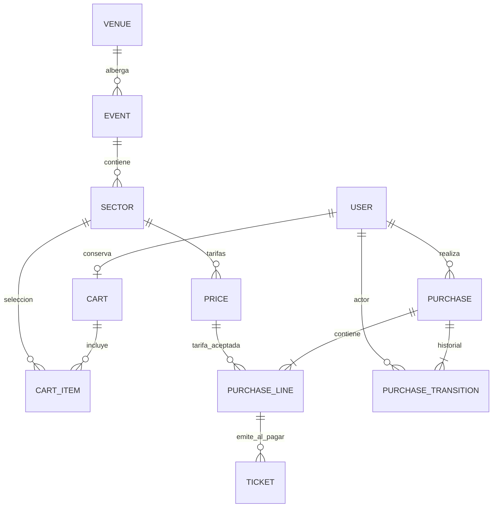

# Modelo relacional en tercera forma normal

## Criterio aplicado

Primera forma normal: valores atomicos, sin listas de sectores o tickets dentro de una columna. Segunda forma normal: atributos dependientes de la clave completa, incluyendo claves candidatas compuestas. Tercera forma normal: no almacenar dependencias transitivas entre atributos no clave.

No se duplica el nombre del evento en la compra, el comprador en la entrada, el precio monetario en cada linea ni un total que pueda desincronizarse. Las representaciones JSON pueden mostrar estos datos unidos; **mostrar datos derivados no equivale a duplicarlos en tablas**.

## Entidades y dependencias

| Tabla de negocio | Claves y dependencia funcional |
| --- | --- |
| `accounts_user` | `id -> username, email, password_hash, nombres, apellidos, role, indicadores de cuenta`. Username y correo son candidatos unicos, tambien sin distinguir mayusculas. Usa el usuario extendido de Django. |
| `catalog_venue` | `id -> name, address, city, active`. Candidato adicional `(name, city)`. El recinto no repite eventos. |
| `catalog_event` | `id -> name, slug, artist, description, starts_at, venue_id, status, image, artwork, created_at`. Slug es candidato unico. El nombre/direccion del recinto se obtiene por FK. Artist es una etiqueta atomica de la agrupacion; no existe aqui una ficha de artista con datos repetidos. |
| `catalog_sector` | `id -> event_id, name, capacity, active`. Candidato `(event_id, name)`. La localidad pertenece a un solo evento. |
| `catalog_price` | `id -> sector_id, amount, created_at`. Cada fila es una version inmutable de la tarifa. CLP es la unica moneda de la aplicacion. |
| `sales_cart` | `id -> user_id, version, updated_at`. `user_id` es unico: OneToOne. Version identifica cambios de seleccion, no es un total. |
| `sales_cartitem` | `id -> cart_id, sector_id, quantity`. Candidato `(cart_id, sector_id)`. No hay precio copiado en el carrito. |
| `sales_purchase` | `id(UUID) -> user_id, status, checkout_key, checkout_digest, fechas`. Candidato `(user_id, checkout_key)`. Digest identifica la solicitud aceptada para detectar reintentos incompatibles; no es un total ni una copia del carrito. |
| `sales_purchaseline` | `id -> purchase_id, price_id, quantity`. Candidato `(purchase_id, price_id)`. Sector y evento se obtienen recorriendo Price; amount tambien pertenece a Price. |
| `sales_ticket` | `id(UUID) -> line_id, ordinal, issued_at, used_at`. Candidato `(line_id, ordinal)`. No duplica comprador, evento, localidad, precio o estado de compra. |
| `sales_purchasetransition` | `id -> purchase_id, actor_id, previous_status, new_status, reason, created_at`. Cada fila describe un hecho de auditoria; el estado anterior es parte de ese hecho, no un segundo estado actual editable. |

Las tablas de permisos, migraciones, sesiones y lista negra JWT pertenecen a los componentes de Django/SimpleJWT. Las sesiones no autentican las pantallas del negocio: se usa JWT.

## Datos calculados, no columnas editables

```text
precio_actual(localidad) = ultima fila Price de esa localidad
subtotal(linea) = linea.quantity * linea.price.amount
total(compra) = SUM(subtotales de sus lineas)
comprometido(localidad) = SUM(cantidades de compras PAGADO o ENTREGADO)
disponible(localidad) = capacity - comprometido(localidad)
estado(ticket) = ANULADA si compra CANCELADO;
                 UTILIZADA si used_at existe;
                 VIGENTE en otro caso (solo se emiten al pagar)
```

La disponibilidad se calcula en SQL con subconsultas, `SUM`, `Coalesce` y expresiones `F`. No existe un campo `stock` que pueda contradecir las compras. Cambiar atomicamente a PAGADO produce el descuento logico; cambiar a CANCELADO produce la reposicion. ENTREGADO sigue consumiendo capacidad.

## Historico sin desnormalizar

1. Cambiar un precio inserta otra fila Price. Las compras antiguas siguen referenciando la tarifa aceptada. No hay endpoint para editar una tarifa historica; `Price.save()` tambien rechaza actualizaciones.
2. Una vez que hay compras, se congelan nombre, artista, fecha y recinto del evento, nombre de la localidad e identidad/direccion del recinto. Descripcion e imagen pueden actualizarse; se permite archivar/desactivar.
3. `PROTECT` desde la linea hacia Price y en otras relaciones impide destruir registros necesarios para compras y entradas.
4. El carrito es mutable y la compra no. Confirmar crea lineas historicas y limpia el carrito en una sola transaccion.
5. Una compra pendiente no reserva cupos, pero conserva el precio aceptado; al pagar se vuelve a comprobar disponibilidad y que el evento siga a la venta.

**Limite de administracion:** no se permiten cambios libres de identidad de un evento vendido. Es una decision deliberada para conservar la 3FN y la historia sin fotografias redundantes en cada linea. Reprogramaciones comerciales complejas requeririan una entidad/version de programacion adicional; no estan implementadas ni exigidas por esta opcion.

## Diagrama



El carrito se crea de forma perezosa: un usuario puede no haber abierto nunca su carrito, pero solo puede tener uno. Cada compra confirmada tiene al menos una linea por las reglas transaccionales. Un ticket solo nace al pagar; su ordinal no sustituye a su UUID global.

## Restricciones y concurrencia

- Unicidad de relaciones y `CHECK` para cantidades/precios positivos, capacidad no negativa y estados validos.
- La API limita cantidad a 100 por localidad, precio a 100.000.000 CLP y capacidad a 1.000.000. No son limites universales de una boleteria: son guardas de este proyecto.
- `transaction.atomic()` agrupa checkout, pago, cancelacion y validacion.
- Orden de bloqueo de inventario: recintos, eventos y localidades, siempre por ID ascendente. El pago bloquea primero su compra; el carrito bloquea primero su fila.
- Pago recalcula disponibilidad despues de adquirir bloqueos. Todas las localidades se validan antes de emitir entradas o cambiar estado.
- Fallar una sola localidad revierte la operacion entera. Repetir pago/cancelacion no repite sus efectos.
- Unicidad de UUID y `(line, ordinal)` protege la emision por unidad.
- Las escrituras de catalogo pasan por servicios que coordinan bloqueos y protegen historia. No se expone un editor SQL ni se promete impedir que un administrador de PostgreSQL altere directamente datos fuera de la aplicacion.
